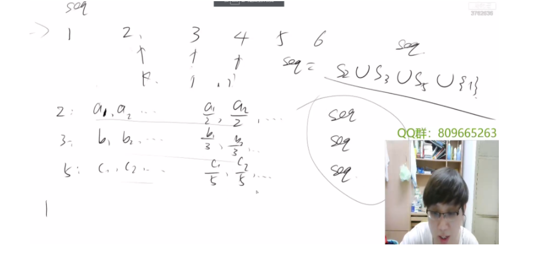
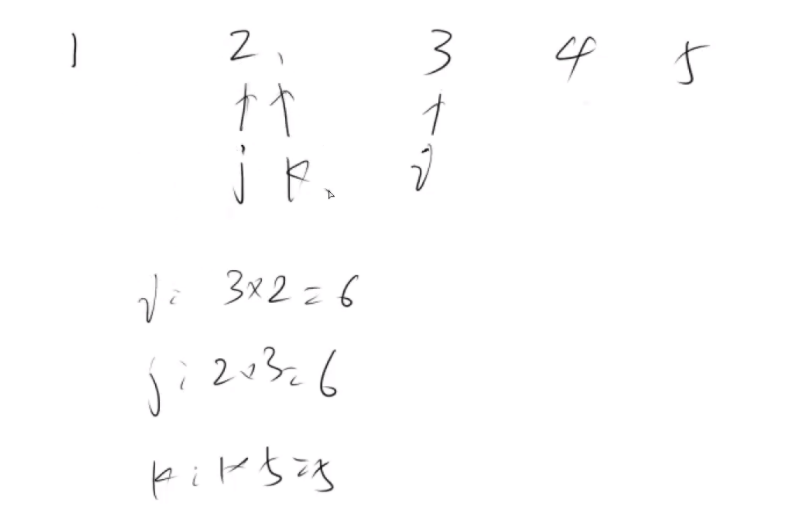

给你一个整数 `n` ，请你找出并返回第 `n` 个 **丑数** 。

**丑数** 就是只包含质因数 `2`、`3` 和/或 `5` 的正整数。


**示例 1：**

```
输入：n = 10
输出：12
解释：[1, 2, 3, 4, 5, 6, 8, 9, 10, 12] 是由前 10 个丑数组成的序列。
```


```java
class Solution {
    public int nthUglyNumber(int n) {
         int[] ans=new int[n+3];
        ans[1]=1;
        int j=1,k=1,p=1;
        int str=1;
        for(int i=1;i<n;i++)
        {
             str=Math.min(ans[j]*2,Math.min(ans[k]*3,ans[p]*5));
            if(str==ans[j]*2) j++;
            if(str==ans[k]*3) k++;
            if(str==ans[p]*5) p++;
            ans[i+1]=str;
        }
        return str;
    }
}
```


###   三路归并

这道题的思路，其实就是把3条路（分别是2,3,5,包含着三个因子的独立队列，合并成一条队列），那么在归并的时候，都是取开头最小的一个，那么重复的元素就可以直接去重，都向后移一位即可。





