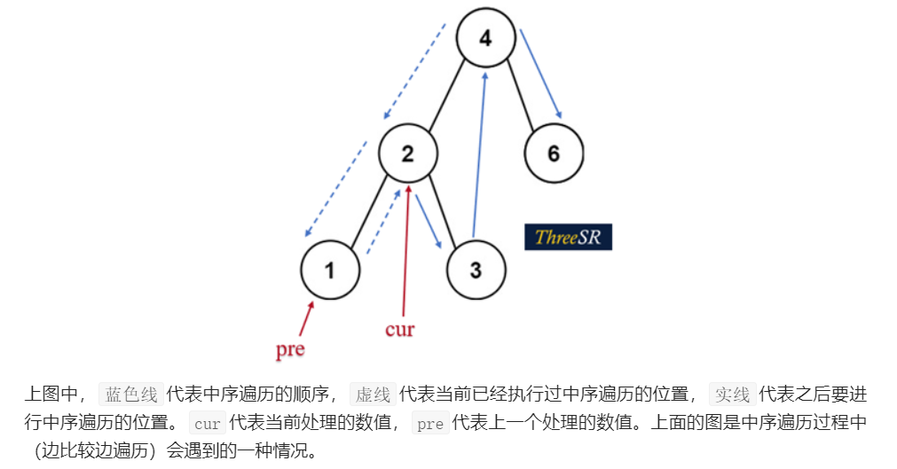

```java
package LeetCode;

public class LeetCode783 {
      public class TreeNode {
          int val;
          TreeNode left;
          TreeNode right;
          TreeNode() {}
          TreeNode(int val) { this.val = val; }
          TreeNode(int val, TreeNode left, TreeNode right) {
              this.val = val;
              this.left = left;
              this.right = right;
          }
      }
    class Solution {
          int ans=Integer.MAX_VALUE;
        TreeNode pre=null;
          public void traversal(TreeNode current)
          {
              if(current==null) return;
              traversal(current.left);
              if(pre!=null)   ans=Math.min(ans,current.val-pre.val);
              pre=current;
              traversal(current.right);

          }

        public int minDiffInBST(TreeNode root) {

            traversal(root);
            return ans;
        }
    }
}

```

